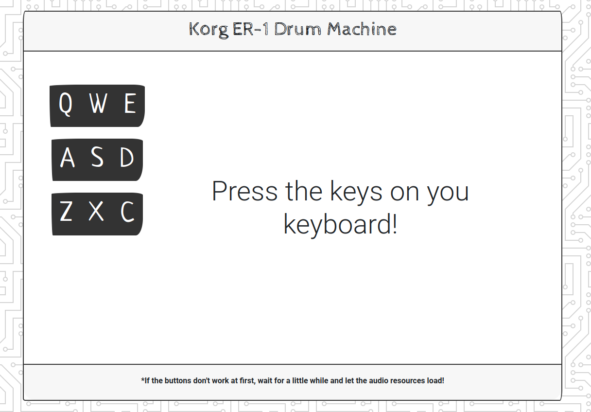

# A React based drum machine

This is a simple react app that recreates some of the sounds from the Korg-ER1 synthesizer. The drum machine accepts both keyboard and mouse inputs, so feel free to experiment!

This project was created as a part of the Front End Development Libraries certification for Free Code Camp.

To view the user stories, tests, and design criterai, please visit [this link](https://www.freecodecamp.org/learn/front-end-development-libraries/front-end-development-libraries-projects/build-a-drum-machine).

To view a live deployment of this project, please see my [codepen](https://codepen.io/OulipianSummer/full/jOMpmxX).

## How To Run

This is a create-react-app project, so you can run `npm install` and  `npm start` to run the app locally.
